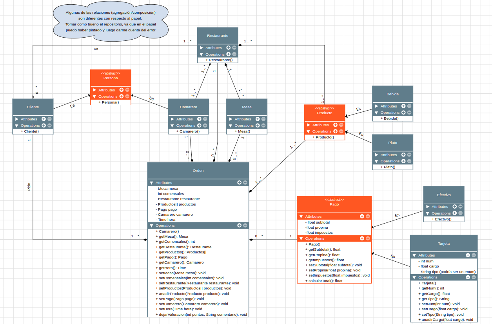

# Simulacro de Examen Entornos de Desarrollo 3er Trimestre

Simulacro de examen de la asignatura **Entornos de Desarrollo** de DAM (CESUR Mallorca) para el curso 2022-2023.

## :clipboard: Enunciado:

Un restaurante necesita almacenar información teniendo en cuenta los siguientes requisistos de software:

-  Un cliente va a un restaurante y puede solicitar una o más órdenes de servicio.
-  Se registra la mesa en la que se sienta y la cantidad de comensales. El cliente puede pedir bebidas y platos. El pedido debe registrar la hora y el camarero que le atiende.
-  Por otra parte, el pago tiene tres datos: unn subtotal (lo consumido por el cliente), la propina y los impuestos por la venta realizada. En relación a esto, se debe de calcular el total del pago.
-  Finalmente, el pedido se puede pagar en efectivo o con tarjeta de crédito. Si es con tarjeta de crédito se necesita saber el número de tajeta, el tipo y el nombre del titular; también se calcula el cargo por el uso de la tarjeta.

## :mag: Análisis de entidades:

Dado el enunciado anterior, se distinguen los siguientes elementos para el diagrama de clases a desarrollar:

-  Cliente
-  Restaurante
   -  Mesa
   -  Camarero
   -  Bebida
   -  Plato
-  Pago con tarjeta
-  Pago en efectivo

## :bulb: Solución propuesta:

## :pencil2: Errores detectados POST examen

Tras haber finalizado el examen (hora 10:45 del día 02/06/2023) se han detectado los siguientes errores:

-  La tarjeta debería estar asociada a un cliente/persona para asignar de una forma correcta el titular (no implementado en el diagrama entregado).
-  Los tipos de tarjeta podrían estar definidos en una clase a parte de tipo Enum.
-  El pago podría ser una interfaz la cual tiene que ser implementada y definida en la clase Orden.
